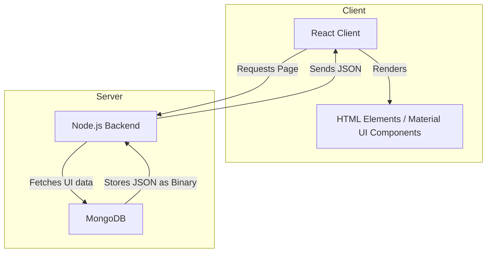

## JSON-Renderer

Suurin osa sovelluskehityksestä itselläni on ollut tällä rakenteella:

1. Lomake kerää dataa
2. Sovellus jalostaa tietoa ja tallentaa sen tietokantaan
3. Sovellus esittää tiedon listoina ja muina tapoina.

Tämä framework suoraviivaistaa tätä prosessia paljon.

- Käyttäjä luo editorilla itse lomakkeen ja tallentaa sen
- Järjestelmä automaattisesti luo siitä web sivun tai lomakkeen.
- Konsultti tarvitaan aluksi lomakkeen toiminnallisuuksien rakentamiseen, mutta se pitäisi onnistua asiakkaan kanssa editorilla saman tien.

